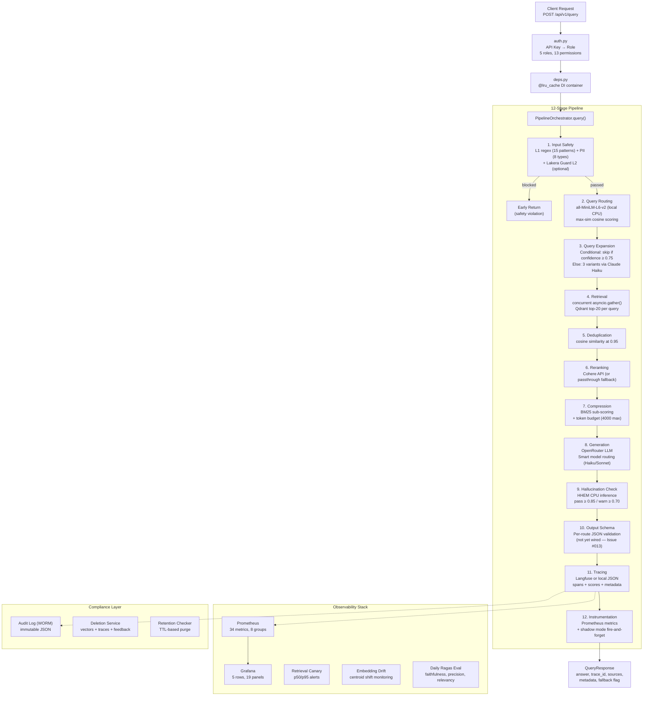
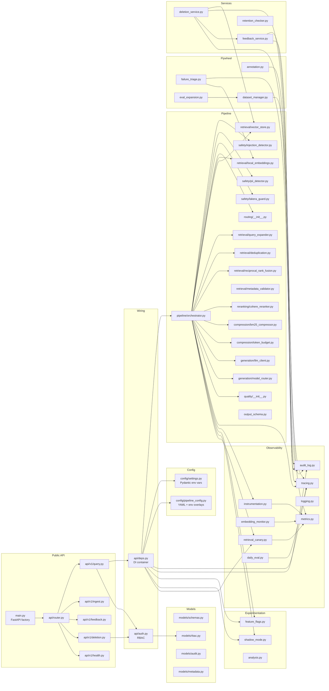
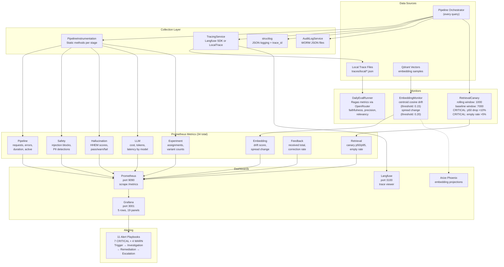
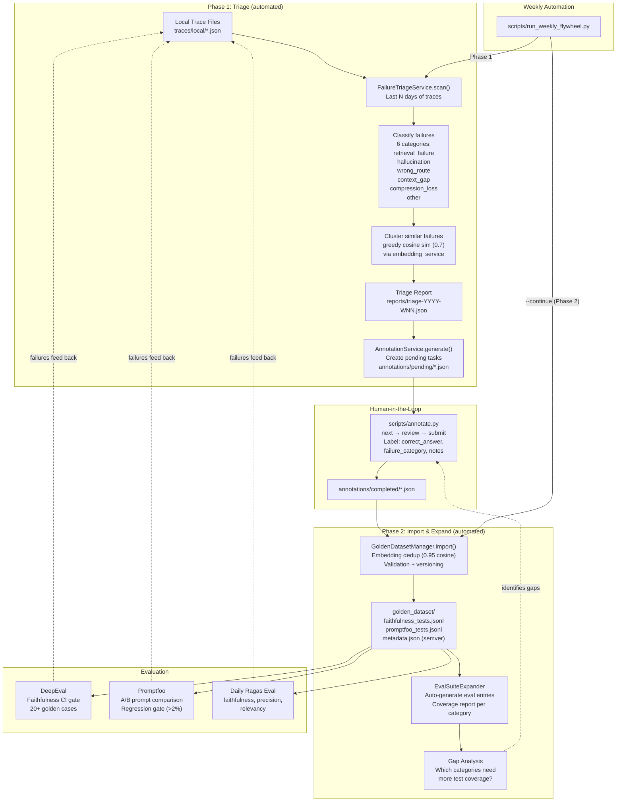
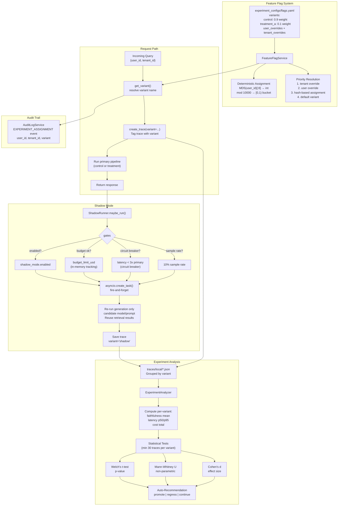

# Architecture

Production-grade RAG (Retrieval-Augmented Generation) pipeline built in Python with FastAPI. Twelve pipeline stages process every query: input safety, semantic routing, multi-query expansion, vector retrieval (Qdrant), deduplication, reranking (Cohere), BM25 compression, LLM generation (OpenRouter), hallucination detection (HHEM on CPU), output validation, tracing (Langfuse or local JSON), and instrumentation (Prometheus). The system includes RBAC, immutable audit logging, right-to-deletion compliance, a data flywheel for continuous improvement, and A/B experimentation with shadow mode. Two runtime dependencies require API keys (OpenRouter, Cohere); everything else runs locally on CPU.

## Architecture Diagrams

### Diagram 1: High-Level System Architecture



### Diagram 2: Module Dependency Graph



### Diagram 3: Request Pipeline Data Flow

```mermaid
flowchart TD
    REQ["QueryRequest\n{query, user_id, tenant_id, session_id}"] --> TRACE["create_trace(variant)\nLangfuse or LocalTrace"]
    TRACE --> LOG["bind_trace_context()\nstructlog adds trace_id"]

    LOG --> SAFETY["SafetyChecker.check_input()"]
    SAFETY --> INJ["InjectionDetector\n15 regex patterns\n9 attack vectors"]
    SAFETY --> PII["PIIDetector\n8 types: email, SSN,\nphone, credit card, ..."]
    SAFETY --> LAK["LakeraGuard (optional)\nML-based L2"]

    INJ & PII & LAK --> SAFE_RESULT{passed?}
    SAFE_RESULT -->|No| BLOCK["Return blocked response\nlog safety event"]
    SAFE_RESULT -->|Yes| ROUTE["QueryRouter.route()"]

    ROUTE --> EMBED_Q["embed_query()\nall-MiniLM-L6-v2\n384-dim, local CPU"]
    EMBED_Q --> COSINE["max-sim cosine scoring\nvs 5 route utterance sets"]
    COSINE --> CONF{confidence ≥ 0.5?}
    CONF -->|No| DEFAULT["default_route\n(rag_knowledge_base)"]
    CONF -->|Yes| MATCHED["matched route\n+ confidence score"]

    DEFAULT & MATCHED --> DISPATCH{route type}
    DISPATCH -->|rag_knowledge_base| RAG["Full RAG Path"]
    DISPATCH -->|direct_llm| DIRECT["Skip retrieval\nDirect LLM call"]
    DISPATCH -->|escalate_human| ESCALATE["Return fallback=true\nHuman handoff"]

    subgraph "RAG Path (stages 3-7)"
        RAG --> EXPAND{confidence ≥ 0.75?}
        EXPAND -->|Yes| SKIP_EXP["Skip expansion\nuse original query only"]
        EXPAND -->|No| MULTI["QueryExpander\n3 variants via Claude Haiku"]
        SKIP_EXP & MULTI --> CONCURRENT["asyncio.gather()\nembed + search per query"]
        CONCURRENT --> QDRANT["Qdrant search\ntop-20 per query, cosine"]
        QDRANT --> RRF["Reciprocal Rank Fusion\nmerge multi-query results"]
        RRF --> DEDUP["Deduplicator\ncosine sim > 0.95 → remove"]
        DEDUP --> RERANK["CohereReranker\n(or passthrough) → top-5"]
        RERANK --> BM25["BM25Compressor\nre-score sentences"]
        BM25 --> BUDGET["TokenBudgetEnforcer\ndrop until ≤ 4000 tokens"]
    end

    BUDGET --> TIER["ModelRouter.resolve_model()\nFAST → Haiku\nSTANDARD/COMPLEX → Sonnet"]
    DIRECT --> TIER
    TIER --> GEN["LLMClient.generate()\nOpenRouter (AsyncOpenAI SDK)\nsystem prompt + context"]

    GEN --> HHEM["HallucinationChecker.check()\nVectara HHEM, CPU inference\nmax aggregation across chunks"]
    HHEM --> SCORE{score}
    SCORE -->|"≥ 0.85"| PASS["PASS — return answer"]
    SCORE -->|"0.70-0.85"| WARN["WARN — return answer\n+ disclaimer"]
    SCORE -->|"< 0.70"| FAIL["FAIL — fallback response\nanswer suppressed"]

    PASS & WARN & FAIL --> INSTRUMENT["PipelineInstrumentation\nPrometheus counters/histograms"]
    INSTRUMENT --> SHADOW["ShadowRunner.maybe_run()\nasyncio.create_task()\nfire-and-forget"]
    SHADOW --> SAVE["trace.save_local()\nJSON to traces/local/"]
    SAVE --> FLUSH["tracing.flush()\nsend to Langfuse (if enabled)"]
    FLUSH --> RESP["QueryResponse"]
```



### Diagram 4: Observability & Monitoring Stack



### Diagram 5: Data Flywheel



### Diagram 6: Experimentation & A/B Testing



## File Tree

```
enterprise-pipeline/
├── Dockerfile                              # Production container image
├── Makefile                                # dev, test, lint, typecheck, infra targets
├── docker-compose.yaml                     # Qdrant + Langfuse + Redis
├── docker-compose.monitoring.yaml          # Prometheus + Grafana
├── pipeline_config.yaml                    # Master config (11 nested sections)
├── promptfoo.config.yaml                   # Promptfoo eval config (OpenRouter)
├── pyproject.toml                          # Dependencies, build config, tool settings
├── requirements.lock                       # Locked dependency versions
│
├── src/
│   ├── main.py                             # FastAPI app factory + lifespan events
│   │
│   ├── config/
│   │   ├── settings.py                     # Pydantic env var schema
│   │   └── pipeline_config.py              # YAML config + env overlay loader (deepmerge)
│   │
│   ├── models/
│   │   ├── schemas.py                      # API request/response models
│   │   ├── rbac.py                         # 5 roles, 13 permissions, PermissionChecker
│   │   ├── audit.py                        # AuditEvent, AuditActor, AuditResource
│   │   └── metadata.py                     # ChunkMetadata, DocType
│   │
│   ├── api/
│   │   ├── auth.py                         # API key → Role RBAC, require_permission()
│   │   ├── deps.py                         # @lru_cache DI wiring for all services
│   │   ├── router.py                       # Route aggregator (v1 + health)
│   │   └── v1/
│   │       ├── query.py                    # POST /api/v1/query
│   │       ├── ingest.py                   # Document ingestion + chunking
│   │       ├── feedback.py                 # User feedback collection + stats
│   │       ├── deletion.py                 # Right-to-deletion endpoints
│   │       └── health.py                   # /health, /metrics, /ready
│   │
│   ├── pipeline/
│   │   ├── orchestrator.py                 # 12-stage pipeline coordinator
│   │   ├── safety/
│   │   │   ├── injection_detector.py       # L1: 15 regex patterns, 9 attack vectors
│   │   │   ├── pii_detector.py             # 8 PII types (email, SSN, phone, CC, ...)
│   │   │   └── lakera_guard.py             # L2: ML-based injection (optional API)
│   │   ├── routing/
│   │   │   ├── __init__.py                 # QueryRouter: local embeddings + max-sim
│   │   │   └── routes.yaml                 # 5 semantic routes, 12-13 utterances each
│   │   ├── retrieval/
│   │   │   ├── vector_store.py             # Qdrant client (upsert, search, delete)
│   │   │   ├── embeddings.py               # Abstract EmbeddingService interface
│   │   │   ├── local_embeddings.py         # all-MiniLM-L6-v2 (384-dim, CPU)
│   │   │   ├── query_expander.py           # Multi-query via Claude Haiku
│   │   │   ├── deduplication.py            # Cosine dedup (0.95 threshold)
│   │   │   ├── reciprocal_rank_fusion.py   # RRF for multi-query merging
│   │   │   └── metadata_validator.py       # Compliance gate (user/doc/tenant IDs)
│   │   ├── reranking/
│   │   │   └── cohere_reranker.py          # Cohere API (passthrough fallback)
│   │   ├── compression/
│   │   │   ├── bm25_compressor.py          # BM25 sentence re-scoring
│   │   │   └── token_budget.py             # 4000 token max enforcement
│   │   ├── generation/
│   │   │   ├── llm_client.py               # OpenRouter (AsyncOpenAI SDK)
│   │   │   └── model_router.py             # Heuristic tier: FAST/STANDARD/COMPLEX
│   │   ├── quality/
│   │   │   └── __init__.py                 # HHEM hallucination check (CPU inference)
│   │   └── output_schema.py               # Per-route JSON schema validation
│   │
│   ├── observability/
│   │   ├── tracing.py                      # Langfuse or local JSON fallback
│   │   ├── audit_log.py                    # Immutable WORM audit log
│   │   ├── logging.py                      # structlog JSON config + trace binding
│   │   ├── metrics.py                      # 34 Prometheus metrics, 8 groups
│   │   ├── instrumentation.py              # Static methods for metric recording
│   │   ├── embedding_monitor.py            # Cosine centroid drift detection
│   │   ├── retrieval_canary.py             # Rolling window p50/p95 alerts
│   │   └── daily_eval.py                   # Ragas eval runner (OpenRouter judge)
│   │
│   ├── experimentation/
│   │   ├── feature_flags.py                # MD5 hash deterministic variant assignment
│   │   ├── shadow_mode.py                  # Fire-and-forget candidate generation
│   │   └── analysis.py                     # Welch t-test, Mann-Whitney U, Cohen's d
│   │
│   ├── flywheel/
│   │   ├── failure_triage.py               # Scan, classify (6 types), cluster failures
│   │   ├── annotation.py                   # Task generation + submission + export
│   │   ├── dataset_manager.py              # Golden dataset import, dedup, versioning
│   │   └── eval_expansion.py               # Auto-expand eval suite + coverage report
│   │
│   ├── services/
│   │   ├── deletion_service.py             # Right-to-deletion (vectors + traces + feedback)
│   │   ├── feedback_service.py             # Feedback collection + rate tracking
│   │   └── retention_checker.py            # TTL-based data purge
│   │
│   └── utils/
│       └── tokens.py                       # tiktoken helpers
│
├── scripts/
│   ├── ingest_documents.py                 # Load, chunk, embed, upsert to Qdrant
│   ├── run_e2e_trace.py                    # Full pipeline trace (mocked externals)
│   ├── run_adversarial_tests.py            # 20 injection payloads + PII patterns
│   ├── test_routing_accuracy.py            # Labeled routing test set
│   ├── test_multi_query_recall.py          # Single vs multi-query recall comparison
│   ├── generate_synthetic_tests.py         # 77 synthetic HHEM test cases
│   ├── load_test.py                        # Concurrent load testing
│   ├── run_daily_eval.py                   # Ragas eval on recent traces
│   ├── run_failure_triage.py               # Failure scan + classify + cluster
│   ├── run_weekly_flywheel.py              # Two-phase flywheel automation
│   ├── annotate.py                         # Interactive annotation CLI
│   ├── expand_golden_dataset.py            # Import, stats, coverage
│   ├── run_experiment_analysis.py          # Statistical variant analysis
│   ├── validate_environment.py             # API key + service connectivity check
│   ├── validate_routing.py                 # Routing accuracy validation
│   ├── validate_production.py              # Full production checklist
│   └── check_regression.py                 # Promptfoo CI eval gate
│
├── tests/
│   ├── unit/                               # ~49 test files, ~318 tests
│   ├── eval/                               # DeepEval faithfulness + exit criteria (~56 tests)
│   └── integration/                        # E2E pipeline + API key-dependent tests
│
├── environments/
│   ├── base.yaml                           # Base config overlay
│   ├── development.yaml                    # Dev overrides
│   └── production.yaml                     # Prod overrides
│
├── experiment_configs/
│   └── flags.yaml                          # Feature flag variants + overrides
│
├── golden_dataset/
│   ├── faithfulness_tests.jsonl            # DeepEval test cases
│   ├── promptfoo_tests.jsonl               # Promptfoo test cases
│   └── metadata.json                       # Dataset versioning (semver)
│
├── prompts/
│   ├── rag_system.txt                      # Default system prompt
│   ├── current.txt                         # Promptfoo baseline prompt
│   └── candidate.txt                       # Promptfoo candidate prompt
│
├── monitoring/
│   ├── prometheus.yml                      # Scrape config
│   └── grafana/
│       └── dashboards/
│           └── pipeline-health.json        # 5 rows, 19 panels
│
├── docs/
│   ├── 02-prd.md                           # Product requirements
│   ├── 03-implementation-plan.md           # 3 phases, 8 waves
│   ├── 04-technical-specs.md               # Infrastructure, schemas, APIs
│   ├── deployment-guide.md                 # Full deployment instructions
│   ├── security-review.md                  # Security assessment
│   ├── adr/                                # 13 architecture decision records
│   ├── runbooks/
│   │   ├── operations.md                   # Daily/weekly/monthly ops
│   │   └── alerting-playbooks.md           # 11 alerts with remediation
│   └── baselines/
│       ├── production-baseline.json        # Performance + quality baselines
│       └── real-latency-baselines.json     # Measured stage latencies
│
├── annotations/                            # Flywheel annotation storage
│   ├── pending/                            # Tasks awaiting human review
│   └── completed/                          # Submitted annotations
│
├── traces/                                 # Pipeline trace storage
│   └── local/                              # LocalTrace JSON files
│
├── audit_logs/                             # Immutable WORM audit log
│   └── local/                              # Individual audit event JSON files
│
└── reports/                                # Weekly triage reports
```

## Notable Architectural Decisions

**Constructor dependency injection, not globals.** Every service takes its dependencies as constructor arguments. Wiring happens in `deps.py` via `@lru_cache` singletons. This makes every component independently testable — swap real Qdrant for a mock, real OpenRouter for a stub, real Langfuse for a LocalTrace — without touching any service code. The orchestrator constructor takes 15 parameters, each an interface or concrete service.

**Graceful degradation as a first-class pattern.** Missing API keys never crash the pipeline. Cohere reranking falls back to passthrough (returns original list). Lakera Guard L2 is silently skipped. Query expansion fails gracefully to the original query. Langfuse tracing falls back to local JSON files with the same schema. This means the pipeline runs with zero external API keys (except OpenRouter for generation) — ideal for local development, CI testing, and cost control.

**Local-first ML inference.** Routing uses `all-MiniLM-L6-v2` (384-dim, ~80MB) on CPU — no embedding API calls. Hallucination detection uses Vectara's HHEM model on CPU (~150ms warm inference). These eliminate two API round-trips from the critical path and remove API key requirements for core quality checks.

**Max-sim over mean-sim for semantic routing.** Route scoring computes cosine similarity between the query embedding and every utterance in each route, then takes the maximum (best match) rather than the mean. Mean-sim dilutes signal when a route has diverse utterances. This single change improved routing accuracy from 40% to 90% (18/20 labeled queries).

**Immutable audit log at the API level.** `AuditLogService` has `log_event()`, `get_event()`, and `list_events()` — no `delete()` or `update()` methods exist. WORM (write-once, read-many) is enforced by the class interface, not by filesystem permissions. Every deletion request, experiment assignment, feedback submission, and compliance action creates an audit event with actor, resource, and tenant context.

**Two-phase flywheel with human-in-the-loop.** The weekly automation script runs in two phases: Phase 1 (triage + generate annotation tasks) is fully automated. A human reviews and annotates between phases. Phase 2 (`--continue` flag) imports annotations, deduplicates against the golden dataset, expands eval suites, and generates a coverage report. This keeps humans in the quality loop while automating the mechanical work.
