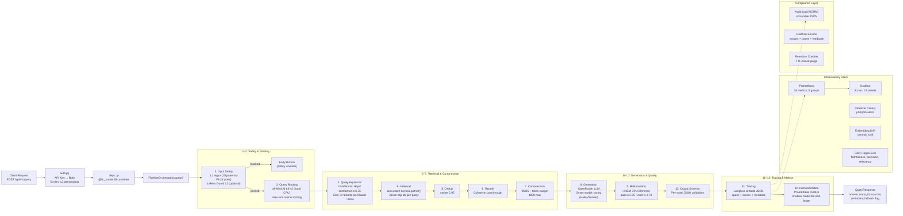

# Enterprise AI Pipeline

Production-grade RAG (Retrieval-Augmented Generation) pipeline built in 3 phases across 8 waves. Features a 12-stage pipeline with input safety (regex injection + PII detection), semantic query routing, multi-query expansion, Qdrant vector retrieval, BM25 compression, LLM generation via OpenRouter, HHEM hallucination detection, and full observability through Langfuse tracing, Prometheus metrics, and Grafana dashboards. Includes RBAC, audit logging, right-to-deletion, a data flywheel for continuous improvement, and A/B experimentation with shadow mode.

## Architecture



**[Full architecture doc with 6 diagrams, file tree, and design decisions →](ARCHITECTURE.md)**

## Quick Start

```bash
# 1. Install dependencies
pip install -e ".[dev,eval]"
python -m spacy download en_core_web_sm

# 2. Configure environment
cp .env.example .env
# Edit .env -- set OPENROUTER_API_KEY at minimum

# 3. Start infrastructure (Qdrant, Langfuse, Redis)
make infra

# 4. Start the API server
make dev

# 5. Verify health
curl http://localhost:8000/health
```

## Running in Production

```bash
# Start all services via Docker Compose
docker compose up -d

# Verify environment
python scripts/validate_environment.py

# Ingest documents
python scripts/ingest_documents.py \
  --input-dir docs/sample_corpus/ \
  --user-id system \
  --tenant-id default

# Start monitoring stack (Prometheus + Grafana)
docker compose -f docker-compose.monitoring.yaml up -d

# Access dashboards
# Pipeline API:  http://localhost:8000
# Grafana:       http://localhost:3001 (admin/admin)
# Prometheus:    http://localhost:9090
# Langfuse:      http://localhost:3100
# Qdrant:        http://localhost:6333/dashboard
```

See [docs/deployment-guide.md](docs/deployment-guide.md) for full deployment instructions.

## Running Tests

```bash
# Unit tests (294 pass)
make test

# Lint
make lint

# Type check
make typecheck

# All quality checks
make all-tests

# Integration tests (requires Docker services + API keys)
make test-integration

# Eval tests (requires OPENROUTER_API_KEY)
make test-eval

# E2E trace (mocked external deps, real local components)
python -m scripts.run_e2e_trace

# Load test
python scripts/load_test.py --queries 10 --concurrency 1

# Adversarial security tests
python scripts/run_adversarial_tests.py
```

## Service Ports

| Service       | Port | Purpose                          |
|---------------|------|----------------------------------|
| Pipeline API  | 8000 | FastAPI (`/query`, `/health`, `/metrics`) |
| Qdrant HTTP   | 6333 | Vector store                     |
| Qdrant gRPC   | 6334 | Vector store (internal)          |
| Langfuse      | 3100 | Trace viewer                     |
| Langfuse DB   | 5433 | PostgreSQL for Langfuse          |
| Redis         | 6379 | Caching                          |
| Prometheus    | 9090 | Metrics                          |
| Grafana       | 3001 | Dashboards                       |

## Environment Variables

| Variable             | Required | Description                          |
|----------------------|----------|--------------------------------------|
| `OPENROUTER_API_KEY` | Yes      | LLM generation and query expansion   |
| `COHERE_API_KEY`     | No       | Reranking (passthrough fallback)     |
| `LAKERA_API_KEY`     | No       | L2 ML injection detection            |
| `QDRANT_HOST`        | No       | Qdrant host (default: `localhost`)   |
| `QDRANT_PORT`        | No       | Qdrant port (default: `6333`)        |
| `PIPELINE_ENV`       | No       | `development` or `production`        |
| `LOG_LEVEL`          | No       | Logging level (default: `INFO`)      |
| `LOG_FORMAT`         | No       | `console` or `json`                  |
| `API_KEY_ROLES`      | No       | RBAC key-role mappings               |

See `.env.example` for all variables.

## Configuration

| File                           | Purpose                                        |
|--------------------------------|------------------------------------------------|
| `pipeline_config.yaml`        | Master config (safety, routing, generation, compliance) |
| `.env` / `.env.example`       | API keys and service endpoints                 |
| `src/pipeline/routing/routes.yaml` | Semantic routing rules (5 routes)         |
| `environments/{base,development,production}.yaml` | Environment-specific overrides |
| `experiment_configs/flags.yaml` | Feature flag configuration                   |
| `promptfoo.config.yaml`       | Promptfoo eval configuration                   |

## Project Structure

```
src/
  main.py                  # FastAPI app factory
  config/                  # Pydantic settings + YAML config
  models/                  # Schemas, RBAC, metadata
  api/                     # Auth, DI, v1 routes
  pipeline/                # 12-stage pipeline (safety, routing, retrieval, generation, quality)
  observability/           # Tracing, audit log, metrics, drift/canary monitoring
  experimentation/         # Feature flags, shadow mode, A/B analysis
  flywheel/                # Failure triage, annotation, dataset expansion
  services/                # Deletion, feedback, retention
tests/
  unit/                    # 47 test files (~294 tests)
  eval/                    # DeepEval faithfulness tests
  integration/             # E2E pipeline tests
scripts/                   # Operational scripts (ingest, eval, triage, load test)
docs/                      # PRD, specs, ADRs, baselines, runbooks
monitoring/                # Prometheus + Grafana config
environments/              # Environment-specific config overlays
```

## Wave Completion Status

| Wave | Focus                              | Tests |
|------|------------------------------------|-------|
| 1    | Retrieval Quality Foundation       | 31    |
| 2    | Input Safety & Query Intelligence  | 45+   |
| 3    | Output Quality & Tracing           | 175   |
| 4    | Compliance & Data Governance       | 239   |
| 5    | Deployment & Experimentation       | 283   |
| 6    | Observability & Monitoring         | 318   |
| 7    | Data Flywheel & Continuous Improvement | 352 |
| 8    | Performance & Optimization             | 374 |

All 8 waves complete. 374 tests passing, 21 skipped. 10/12 pipeline stages run real logic. 2 stages skipped without API keys (Cohere rerank, Lakera L2).

## Documentation

| Document | Description |
|----------|-------------|
| [Deployment Guide](docs/deployment-guide.md) | Full deployment instructions, Docker, monitoring |
| [Operations Runbook](docs/runbooks/operations.md) | Daily/weekly/monthly ops, incident response |
| [Alert Playbooks](docs/runbooks/alerting-playbooks.md) | 11 alerts with investigation/remediation |
| [ADR Index](docs/adr/README.md) | 13 architecture decision records |
| [PRD](docs/02-prd.md) | Product requirements and success criteria |
| [Implementation Plan](docs/03-implementation-plan.md) | 3 phases, 8 waves |
| [Technical Specs](docs/04-technical-specs.md) | Infrastructure, schemas, APIs, security |
| [Security Review](docs/security-review.md) | Security assessment and findings |
| [Production Baseline](docs/baselines/production-baseline.json) | Performance and quality baselines |

## License

See [LICENSE](LICENSE) for details.
